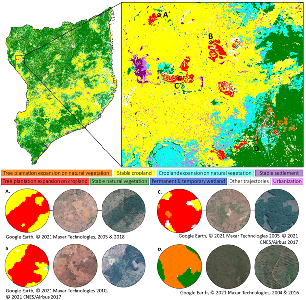
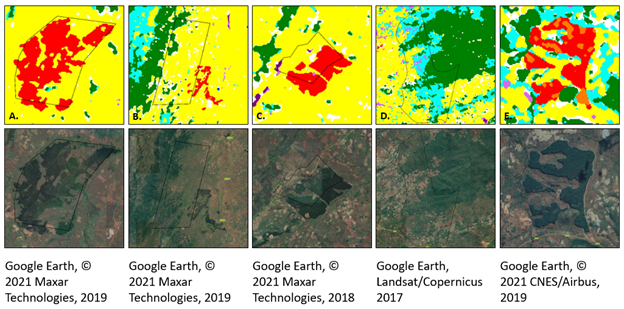

This blog post is based on [Bey et al. 2021](https://doi.org/10.1088/2515-7620/ac26ab) and [this Twitter thread](https://twitter.com/PMeyfroidt/status/1442850051403956224?s=20&t=zRtrqHCyRWgHZz24fdwnyg).

<!--more-->

In this study we present a remote sensing technique to map tree plantations with high accuracy in a challenging context (Miombo dry forests, little spectral & phenological differences between plantations and natural forests).

We show that in Northern Mozambique, ~70% of large-scale tree plantation expansion between 2001-2017 occurred on cropland, the remainder on natural forest and grasslands; suggesting stronger tradeoffs with livelihoods than with nature conservation.

Comparing our maps with government cadastral records, ~40% of plantation expansion occurred on lands not legally designated for this land use. Relying on cadastral records only for assessing drivers & impacts of land use change (or LSLA), and policy impacts, can be misleading.

The maps are available online in Earth Engine, they also cover other land use/covers (cropland, natural forests, grasslands) in the four northernmost provinces of Mozambique over four time periods: [Link to interactive map in Google Earth Engine](https://code.earthengine.google.com/fc89d25b9e939c37a6eb93fd5aec6919)