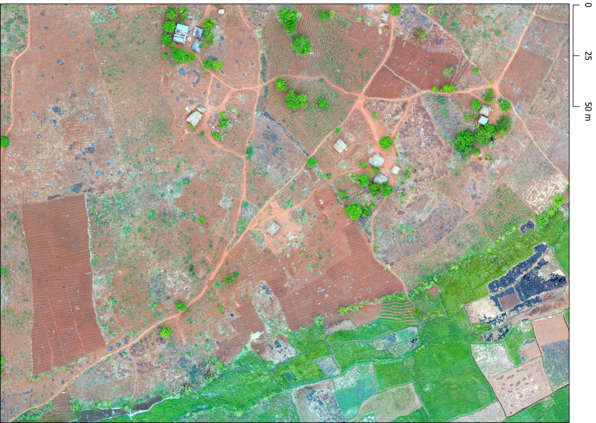
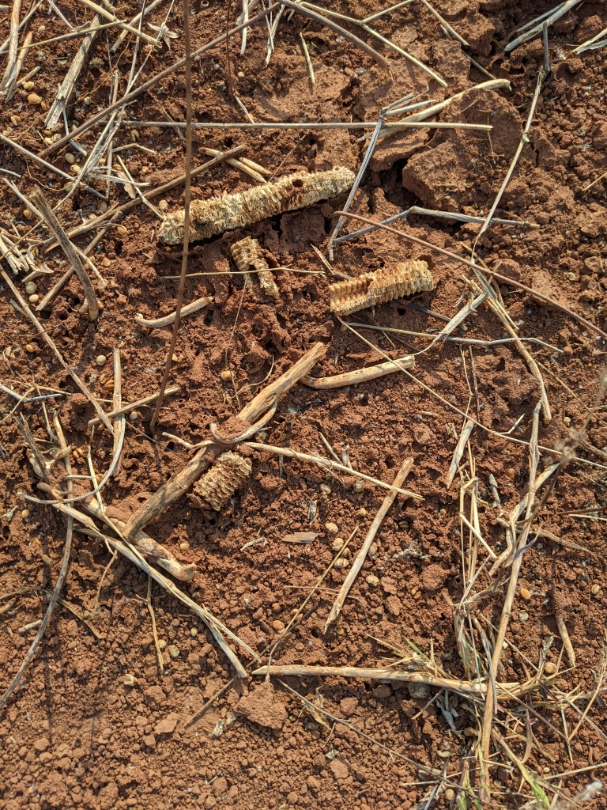
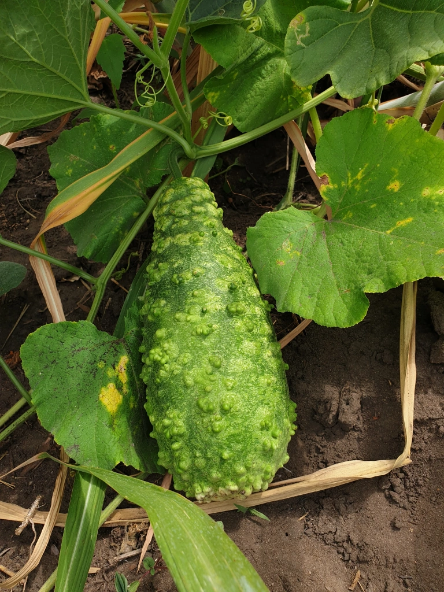
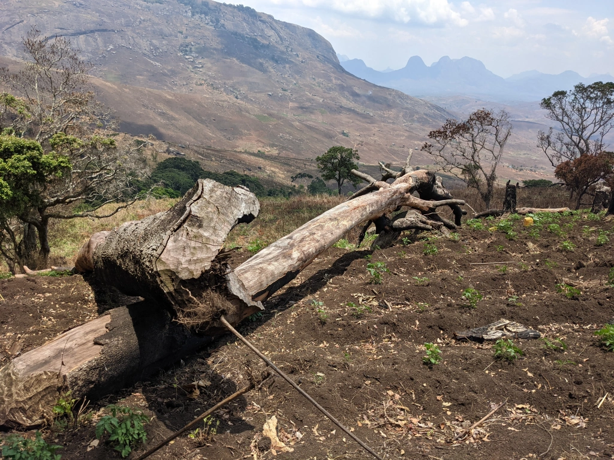
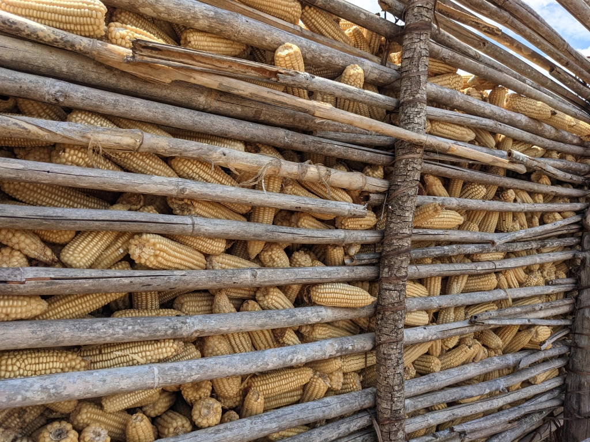
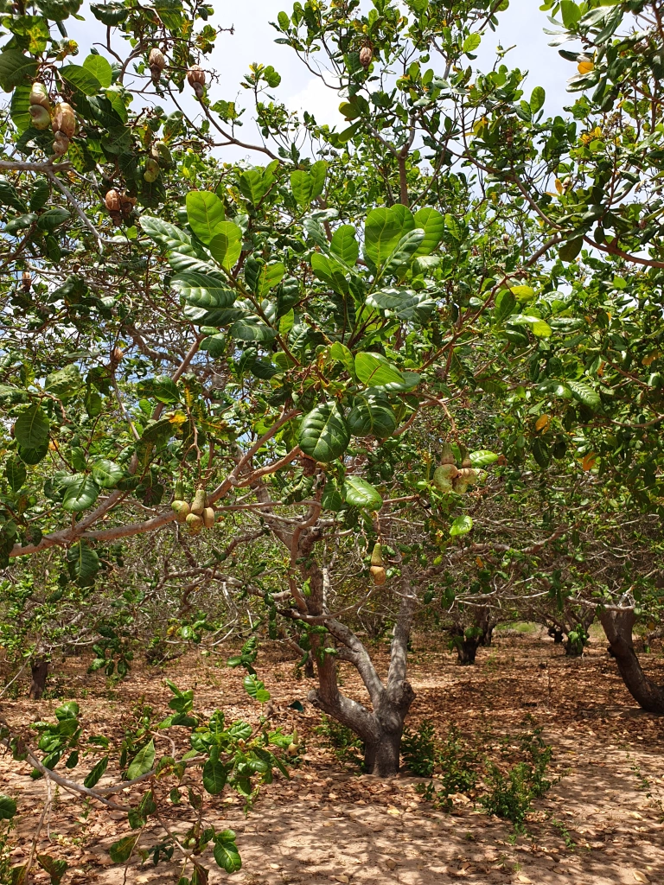
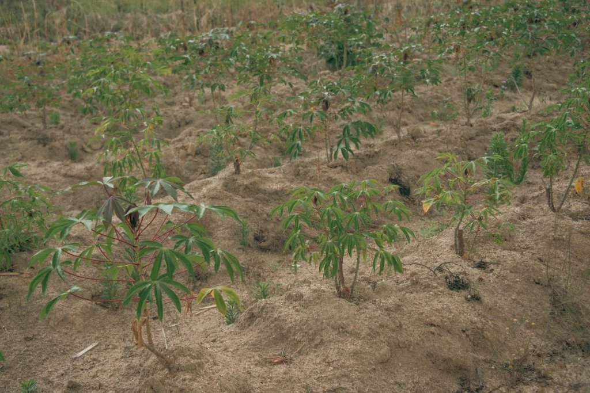
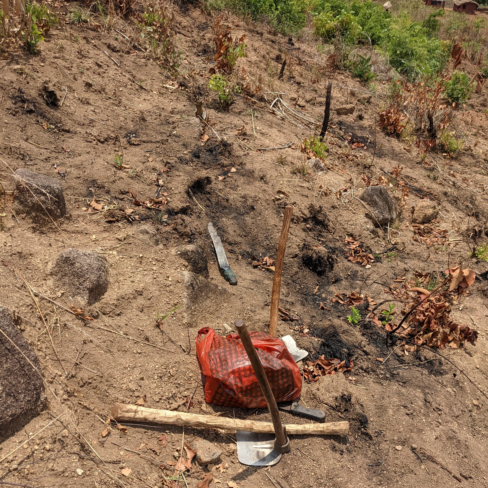
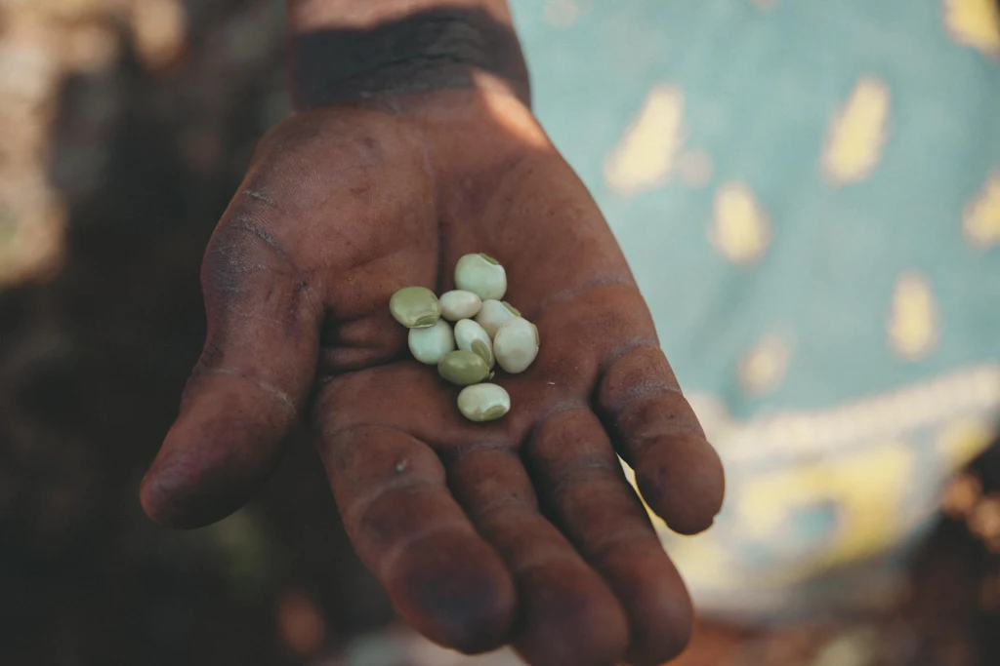

Smallholders in Mozambique call their fields machambas. 
<!--more-->
Machambas constitute a key source of income and food to most smallholders in this region. Definitions of what constitutes a smallholder are manifold, but in the majority of cases, the term relates to the land area available for production. As such, “smallholder” is an umbrella term for diverse modes of production and cannot be easily defined, neither across continents, nor regionally. The characteristics of machambas are as diverse as the people cultivating them. This blog post provides a handful of impressions of the machambas in Northern Mozambique to illustrate this diversity. The material presented here was collected by a team of five MIDLAND researchers during a field trip across the three provinces of Niassa, Zambezia and Nampula in mid November 2021.

November is the very end of the dry season, a time when soils are extremely dry due to low rainfall over several months. In this period, smallholders commonly start to prepare land for the coming growing season. Overall the landscape was characterized by exposed dry soils, and road dust covered huts, cars, animals, and people likewise. Amidst the dry landscape, we saw patches of lush green alongside rivers and lakes.

These “wetlands in drylands” can be used for cultivating crops year-round, including water-intensive fruits and vegetables suitable for commercial activities. These lands were particularly fragmented, which indicates that these moist and fertile areas are shared among many community members.

Visiting the foothills of Mount Namuli, Mozambique´s second highest mountain, we observed that machambas covered the steep hill slopes, at elevations of 1,600m and beyond. These machambas are totally inaccessible to machinery or heavy equipment. Farmers climb the slopes to their fields carrying their tools, sometimes several hundred meters above their village.

We visited a few sites bordering the Mecubúri Forest, Mozambique´s largest forest reserve. Here, cultivation requires manual clearing of trees and shrubs. Land is managed extensively, and fields are larger compared to the more consolidated regions nearby agglomerations. Farmers make use of fire for clearing land from remnants of vegetation and distribute seeds on the cleared areas. While remnants of the last harvest were still visible, we did not find signs of land preparation such as tillage. 

Traveling east towards the city of Nampula, the provincial capital, we noted dry and very sandy soils, appearing to be void of organic matter. Cassava is a key crop grown here, likely due to its´ drought tolerant nature. Moreover, cashew trees are scattered in the landscape, creating a characteristic landscape with plentiful of shaded spots. 

In sum, the machambas we encountered were highly diverse. They come in different sizes, with different quality, accessibility to markets and cities, and biophysical factors. These factors influence which crops are grown by smallholders and how land is managed, where and when. Some smallholders, especially in areas with greater connectivity, are able to generate production surplus, cultivate market-oriented crops, and sell them to local markets. Local cultures, customs and traditions also shape crop choices and the land management practices adapted to the cultivation of such crops. Who manages which crops and how tasks are distributed is also determined by gender, age, and roles of individual family members. Land is commonly shared amongst family members, and parcels are further subdivided and distributed to the youngest generation. Smallholders mostly use family labor and low-tech tools for land preparation. Some have access to improved seeds that can be bought in first or second generation.

Small-scale producers in Northern Mozambique manage to achieve so much with so little, given the challenging conditions they’re exposed to, such as dry soils, uncertain rainfall, difficult access to water, absent or low use of fertilizers, and the very small and fragmented fields, often located in long distances from households and placed in inaccessible terrain. It was remarkable how heterogeneous machambas appear within small geographic space. When one is able to recognize the great diversity of farm systems (in terms of soil, crops, farm sizes, topography, climate), it is hard to conceive that untailored one-recipe advices aimed for rapid yield increases based on standard energy-intensive packages of fertilizers and pesticides could work equally well in such diverse contexts, especially when those may degrade the land in the long-term. Local farmers have a vast and deep knowledge about their territories, that has curated specific practices adapted to the local conditions over generations.

We left Mozambique wondering about the adequacy of decontextualized top-down development policies for such wide-ranging settings. The diversity of contexts and knowledge we encountered seemed instead an exceptional opportunity to co-create alternative pathways for decent livelihoods that could offer a diversity of crops for food security and resilience, and don’t compromise the sources of livelihoods for future generations. After discussing with several farmers, it became evident that a necessary element for real food system transformation would have to be horizontal learning, where knowledge is co-produced, reciprocal and collective. A dialogue of wisdom, where practical knowledge is combined with scientific and political knowledges, and where farmers are involved in both research and policy design of and for their own territories, seems not only suited to improve agricultural outcomes, but also to decentralize agricultural development and increase the political participation of local communities and networks to influence current agricultural policy paradigms.

