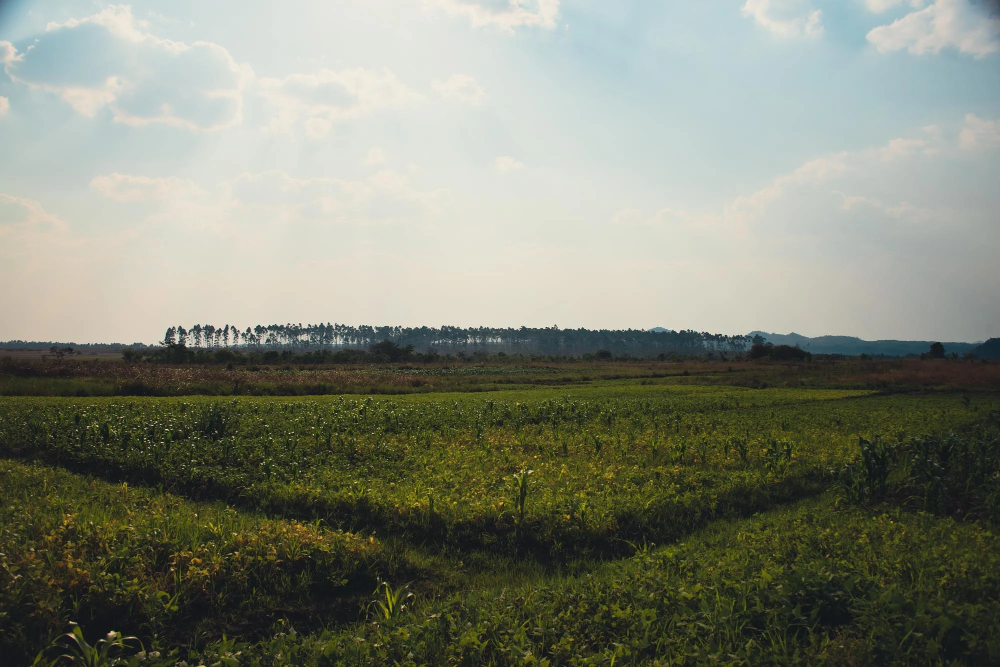
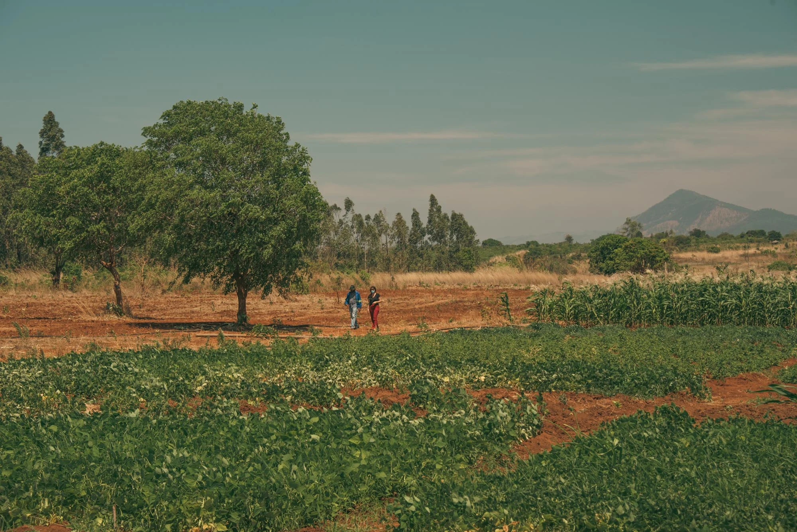
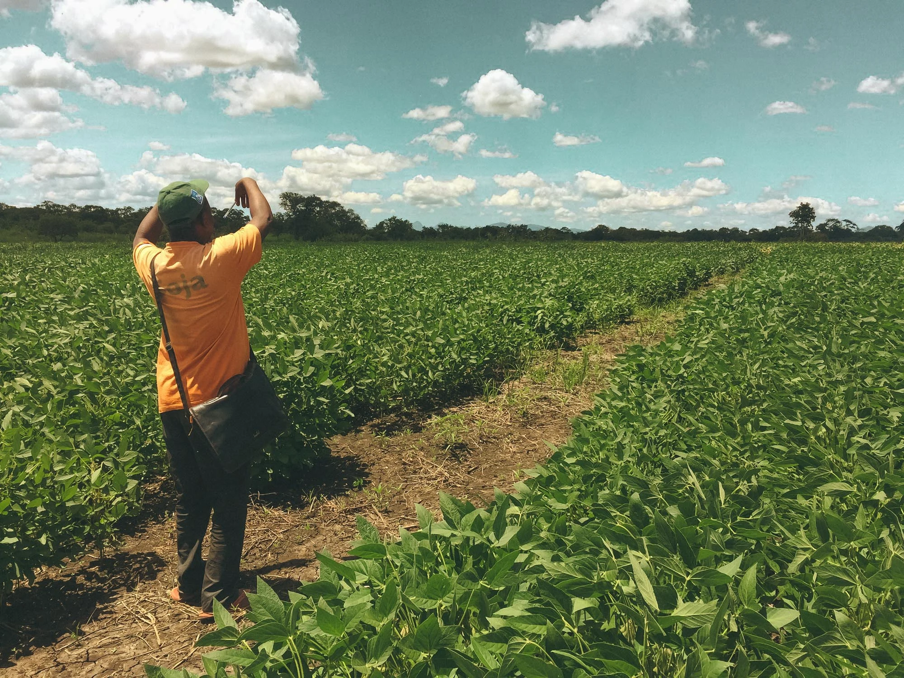
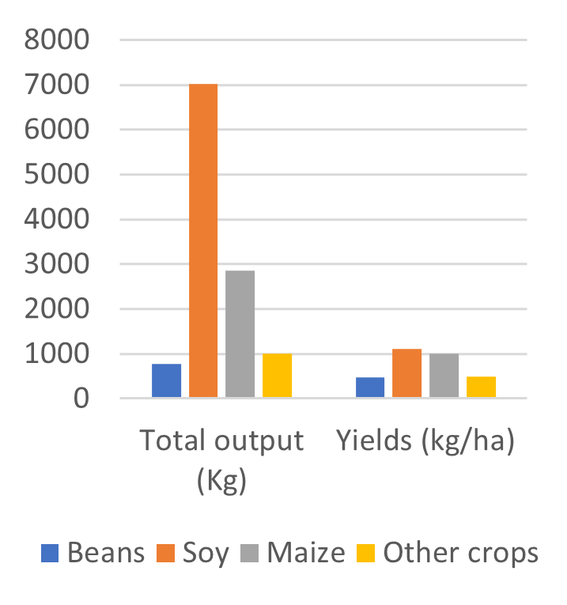
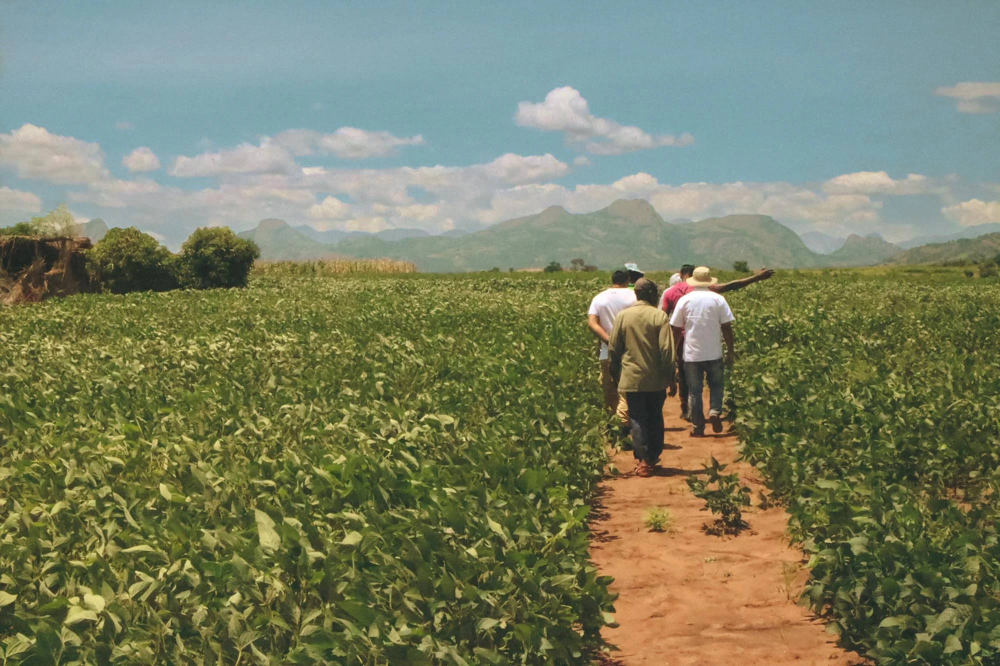

Medium-scale farmers are often neglected in policies and discourses on agricultural development. 
<!--more-->
Most of the agricultural development literature centers around efforts to target small-scale producers for poverty reduction and sustainable development, whereas many countries have specific policies to foster and attract large-scale commercial investments. But the specific role of medium-scale or emergent farmers in local economies is somewhat overlooked both in research and policy; although an emergent body of literature is increasingly spotlighting the rise of medium-scale farmers, and their role in driving agricultural transformation (Anseeuw et al., 2016; Jayne et al., 2016; Burket et al., 2019; Jayne et al., 2019; Wineman et al., 2021; Sitko and Chamberlin, 2015; Scoones and Murimbarimba, 2022; Saweda et al., 2022).

There is not a consensual demarcation for medium-scale farms, but they can be defined as landholdings between 5 to 100 ha (as in Jayne et al., 2016). Besides their size, there are other characteristics associated with the scale of the operations. For example, compared to smallholdings, medium-scale farms tend to use more chemical inputs, more mechanization, and have more commercial operations connected to larger-scale traders and markets, although there is a very large diversity in the realities of medium-scale farming. In our recent work, we also find systematic evidence for 32 countries globally that medium-scale farms have greater labor productivity and greater technical efficiency than small-scale farms; but greater yields and greater labor intensity than large-scale operations, as they employ far more workers per ha than large landholdings (Chiarella, Meyfroidt, Abeygunawardane, Conforti, 2022). These findings suggest that emergent farmers could be in a unique position in that they have comparable labor productivity and total factor productivity than large-scale operations, without compromising the high labor demand and thus employment that small-scale farming provides.

Other advantages previously identified as positive spillovers from large-scale investments may also apply for emergent farms, such as the potential spillover effects on the local economy (through opening greater market opportunities for high value crops, greater connectivity, lower input costs), and the generation of off-farm employment opportunities (through the creation of processing activities, for example) (Burke et al., 2020; Sitko et al., 2018; Herrmann, 2017; Deininger and Xia, 2016). But medium-scale farms may also offer some of the great benefits associated with small-scale farming, such as the strong impacts on poverty reduction because of the greater labor intensity (De Janvry and Sadoulet, 2010).

As a specific example for Mozambique, we take the case of medium-scale soy, beans and maize farmers from Gurué district, in Zambezia province, who were beneficiaries from the NGO TechnoServe, that promoted activities aimed at increasing productivity levels. We got access to a dataset for 32 farmers followed during 6 annual agricultural seasons between 2012 and 2018, and for each of their crops. All of these farmers had access to more than 5 ha combined to cultivate, but soy was the crop that was cultivated in larger plots: 64% of the cultivated soy parcels were farms with sizes between 5 to 20 ha, whereas both maize and beans were mostly planted in parcels between 2 and 5 ha. From the three crops, because of the larger sizes, soy had the larger total production, but also yields 136% greater than beans, although comparable to those for maize (only 11% greater). Soy labor costs per ha were also comparable to those for beans and maize: only 17 and 13% greater, respectively. Soy was the crop with the highest total costs per ha, and greater total output value per ha, almost doubling those for beans, maize and other crops. Hence, net profits per ha for soy were almost five times greater than those for beans and maize. In sum, soy offers greater net profits for medium-scale farmers, greater yields than beans, although comparable yields than maize, and comparable labor costs per ha than both maize and beans.

This group of medium-scale soy farmers is quite specific, as at the national level, 82% of land with soy is cultivated by small-scale farmers, 3% by medium-scale farmers, and 15% by large-scale operations (Baumert et al., 2019 using INE, 2011). To compare these three models of production, Baumert et al. (2019) draw on data for 10 villages also in the province of Zambézia, one of the main soy-producing regions in Mozambique. Overall, the authors find that small and medium-scale farmers performed best in terms of their economic profitability, impacts on food crop production, local livelihoods and land conflicts than large-scale operations. Small-scale soy farmers cultivate an average of 1.1 ha, have mainly a manual mode of production, do not use modern inputs or mechanization, use mostly household and seasonal labor, have yields of 0.75 tons per ha, and a net return of 5,200 Meticais (Mzn) per ha. In contrast, medium-scale or emergent farmers cultivate on average 19 ha, are partly mechanized, use certified seeds and inoculants, produce an average yield of 1.8 tons per ha, and obtain a net return of 16,250 Mzn per ha. Most emergent farmers used to be small-scale farmers before. Large commercial operations operate farms of 1,683 ha on average, are fully mechanized, hire permanent and non-permanent staff, use certified seeds, fertilizers, pesticides, inoculants, and do not produce higher yields than those of emergent farmers (1.5 tons per ha). Small and emergent farmers generated substantial income to farmers without replacing subsistence crop production, spent the most on labor per ha, benefited most workers, but with lower revenues per person. They also generated impacts in the local economy, through soy commercialization with traders and hired mechanization services. Large commercial operations, on the other hand, functioned independently from the local economy, obtaining imported inputs and equipment, and commercializing outside of the local value chain. Large soy investments created higher benefits, but only for a few, not bringing the expected employment opportunities, local investments or multiplier effects to the local economy. Land conflicts regarding boundary demarcation and land expropriation occurred in all modes of production, but were most prominent in areas where land is scarce. 

During our own fieldwork in Mozambique, we were able to interact with a few emergent farmers and learn from some benefits they provided to other small-scale producers in the vicinity. One of the farmers we met told us for example how he would buy improved maize and beans seeds every season and sell the second-generation ones to his neighbors, which still yielded more than the traditional varieties. Another farmer had obtained a larger terrain to cultivate next to an irrigation source, which he had subdivided into smaller plots so he could hire different neighbors to cultivate the different fields. These anecdotes and the prior examples are certainly early evidence that deserves further research to better understand how medium-scale farmers could indeed capitalize on and provide similar benefits as large-scale farming without compromising on the numerous benefits that small-scale farming provides. 

**References**

- Anseeuw, W., Jayne, T., Kachule, R. and Kotsopoulos J. (2016). The quiet rise of medium-scale farms in Malawi. Land 5, no. 3: 19.

- Baumert, S., Fisher, J., Ryan, C., Woollen, E., Vollmer, F., Artur, L., … & Mahamane, M. (2019). Forgone opportunities of large-scale agricultural investment: A comparison of three models of soya production in Central Mozambique. World Development Perspectives, 16, 100145.

- Burke, W. J., Jayne, T. and Sitko, N. (2020). Do medium‐scale farms improve market access conditions for Zambian smallholders?. Journal of Agricultural Economics 71, no. 2, 517-533.

- Chiarella, C., Meyfroidt, P., Abeygunawardane, D., Conforti, P. (2022) Balancing the trade-offs between land productivity, labor productivity and labor intensity. (Submitted) Preprint: https://agrirxiv.org/search-details/?pan=20220148172

- Deininger, K., & Xia, F. (2016). Quantifying spillover effects from large land-based investment: The case of Mozambique. World Development, 87, 227-241. https://doi.org/10.1016/j.worlddev.2016.06.016

- De Janvry, A. and Sadoulet, E (2010). Agricultural growth and poverty reduction: Additional evidence. The World Bank Research Observer, 25(1):1–20.

- Herrmann, R. T. (2017). Large-scale agricultural investments and smallholder welfare: A comparison of wage labor and outgrower channels in Tanzania. World Development, 90, 294-310. https://doi.org/10.1016/j.worlddev.2016.10.007

- Jayne, T., Chamberlin, J., Traub, L., Sitko, N., Muyanga, M., Yeboah, F., Anseeuw W. et al. (2016) Africa’s changing farm size distribution patterns: the rise of medium‐scale farms. Agricultural Economics 47, no. S1: 197-214.

- Jayne, T. S., Muyanga, M., Wineman, A., Ghebru, H., Stevens, C., Stickler, M., … & Nyange, D. (2019). Are medium‐scale farms driving agricultural transformation in sub‐Saharan Africa?. Agricultural Economics, 50, 75-95.

- Saweda O. Liverpool‐Tasie, L., Salim Nuhu, A., Awokuse, T., Jayne, T., Muyanga, M., Aromolaran, A., & Adelaja, A. (2022). Can medium‐scale farms support smallholder commercialisation and improve welfare? Evidence from Nigeria. Journal of Agricultural Economics.

- Scoones, I., & Murimbarimba, F. (2022). The politics of medium-scale farming in Zimbabwe. In The Future of Zimbabwe’s Agrarian Sector (pp. 14-33). Routledge.

- Sitko, N., & Chamberlin, J. (2015). The anatomy of medium-scale farm growth in Zambia: what are the implications for the future of smallholder agriculture?. Land, 4(3), 869-887.

- Sitko, N.J., Chisanga, B., Tschirley, D. & Jayne, T. S. (2018). An evolution in the middle: examining the rise of multinational investment in smallholder grain trading in Zambia. Food Security. 10, 473–488. https://doi.org/10.1007/s12571-018-0767-6

- Wineman, A., Jayne, T. S., Modamba, E. I., & Kray, H. (2021). Characteristics and spillover effects of medium-scale farms in Tanzania. The European Journal of Development Research, 33(6), 1877-1898.
