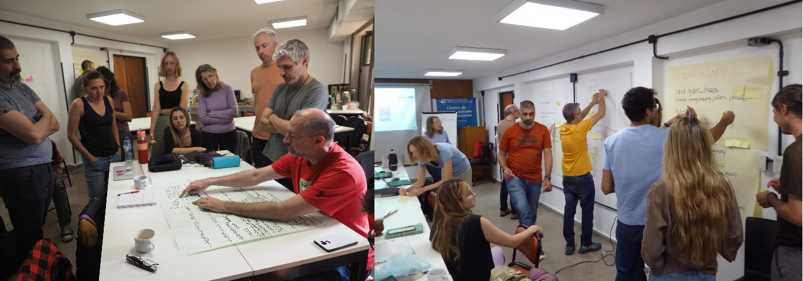

Land uses, and the people involved, are too diverse to be represented by land cover proxies.

<!--more-->

Summary of: 
Pratzer, M. et al. (2024) 'An actor-centered, scalable land system typology for addressing biodiversity loss in the world's tropical dry woodlands', Global Environmental Change, 86, p. 102849. https://doi.org/10.1016/j.gloenvcha.2024.102849

Biodiversity loss is a global crisis threatening human well-being, and the main driver of this crisis is how we use land. The impact of land use happens directly, for example through the destruction or degradation of habitat, and indirectly, for example when remote areas become more accessible to hunters. Conservation planning and action with the aim to protect biodiversity and nature must therefore address the many threats associated with land use. This is easier said than done though, due to the often large number of different types of land-use actors, the diverse activities they engage in, and the diverse relationships these actors have with biodiversity. Land-use actors are also the ones making decisions on how land is used, thus potentially posing threats to species and ecosystems through activities like cropping, logging, or pesticide application. Considering this diversity is therefore important for effective conservation planning - but this is rarely done. In fact, land use is usually oversimplified in conservation assessments and planning, for example by proxying it through land cover maps derived from satellite images that miss land-use actors and many land-use practices.

<i>Dry forest is cleared in the Bolivian Chiquitanía - Copyright Conservation Biogeography Lab / HU Berlin 2022</i>

With our study, we aimed to develop a new approach for representing land use in a more nuanced way - an approach that considers rather than captures the diversity and complexity of real-world land use. We did this for the world's tropical dry forests and savannas. These ecosystems harbor exceptional biodiversity and sustain the livelihoods of hundreds of millions of people. But they are unfortunately also threatened from habitat conversion and overhunting, they remain weakly protected, and they are overlooked by conservation organizations, funders, policymakers, and the general public.

Our starting point was to define land use as a social-ecological system. On the social side of this system, there are land-use actors using the land for specific purposes, with specific characteristics, motives, and behaviors, and embedded in a specific general economic, institutional, or cultural context. On the ecological side, there are environmental conditions and regionally specific ecosystems and their biodiversity. Land-use activities link the 'social' and 'ecological' in these systems, describing the diverse interactions of land-use actors with biodiversity. Through this, these actors (e.g., capitalized farmers) and their activities (e.g., soybean cropping) produce typical landscape patterns (e.g., an agricultural landscape dominated by homogeneous, large soybean fields, producing commodities for international supply chains using capital-intensive inputs). Similar land uses in comparable social-ecological systems often create similar landscapes, affect biodiversity in similar ways, and present similar conservation opportunities. This is what we refer to as typical land systems.

Land systems are typical combinations of land-use actors and their activities.

A big challenge in representing land use more properly for conservation is the sheer number and diversity, and context-specificity of land-use actors and activities. How to go beyond oversimplification without describing every single actor, landscape and case? To solve this challenge and to find a middle ground that recognizes but also structures land-use diversity, we developed a typology of land systems. we described similar land-use actors doing similar things with their land as one 'land system'. As conservation planning usually needs to bridge global-scale top-down priority setting and local-to-regional action on the ground, we defined our typology hierarchically: a global level allows for broad-scale planning and comparison, and nested within, a regional level captures context-specificity and regional nuance for initiatives on the ground.

Detailed spatial data on land use is typically not available at scales and resolutions relevant to conservation initiatives on the ground. Therefore, we chose to explicitly not start from often limiting, coarse, and uncertain global datasets, but to derive our typology conceptually and based on expert knowledge. We organized a total of 12 workshops and involved almost 50 experts from various disciplines and regions of expertise across the tropical dry woodlands: the Argentine Gran Chaco dry forest, the Bolivian Chiquitano forest, the Mozambican Miombo-Mopane woodlands, the Indian Deccan dry forests, and the Cambodian dry forest. In these workshops, we collected information on land-use actors and activities linked to biodiversity threats and conservation opportunities and grouped them into our hierarchical typology of land systems.

Collecting information on land-use actors and activities in an expert workshop - Copyright Conservation Biogeography Lab / HU Berlin 2022

In total, we derived 15 land systems at the global level, from capitalized agriculture (mostly cropping, ranching, and tree plantations), to small-scale activities (such as mixed farming, shifting cultivation, pastoralism, and forest-dwelling), to forestry, to area-based conservation (including public, private, and community-based measures), and to highly modified land uses (such as mining, energy production, and construction). These global systems were then refined, split up, or entirely left out for our five focus regions, yielding five regionalized land system typologies. 

Global extent of tropical dry woodland and the five focus regions.

This revealed many commonalities but also substantial differences among regions. For example, commodity cropping by agribusiness actors is common and similar across the five dry forest regions, but the importance of other capitalized agriculture, such as tree cropping or cattle ranching, varied from region to region. In South America, where cattle ranching for beef production is the most widespread land use, it can occur either based on expansive pastures where all forest has been cleared, in less land-demanding feedlots, or in extensive silvopastoral systems, where remaining tree cover offers some biodiversity benefits. This was completely different in India where there are strong cultural, and often legal, bans on slaughtering cattle and eating beef. 

Cattle-ranching in the Argentine Chaco - Copyright Conservation Biogeography Lab / HU Berlin 2022

In contrast, smallholders share key characteristics across the regions, such as relying on a mix of activities including cropping, livestock rearing, and the use of adjacent or surrounding forests for hunting and collecting resources. However, which of the activities was most important for the livelihoods of smallholders is different across places. We also discovered some land uses linked to complex political phenomena that require regional knowledge, such as processes of land speculation in Bolivia, or companies obtaining land concessions in Cambodia. Lastly, we found that conservation land uses also are remarkably diverse. While state-protected areas are similar across places, the institutional settings and levels of governance and funding vary. Moreover, the relevance and involvement of private actors differ markedly, with no institutional frame for private area-based conservation at all in Bolivia, and stock-listed safari companies co-managing a large part of protected areas in Mozambique. Finally, there are various facets of community-based conservation, including Indigenous reserves, social community forestry, or sacred groves - each implying unique challenges and opportunities.

Land uses are diverse - and so are threats to biodiversity and opportunities for conservation - Copyright Conservation Biogeography Lab / HU Berlin 2022

All in all, our typology shows how diverse and complex land use is. But it goes beyond this: our typology can structure this diversity, which now provides a tool for better considering this diversity in conservation planning and helps to allow for better comparisons and learning from one region to another. It is increasingly clear that for protecting biodiversity, there are no silver-bullet solutions available. We need to design contextualized conservation strategies that are effective and at the same time just. For this, it is key to consider how conservation interacts with existing land uses, taking account of the wide range of land-use actors and activities connected to diverse portfolios of threats to biodiversity, opportunities for interventions, or trade-offs with conservation action.
